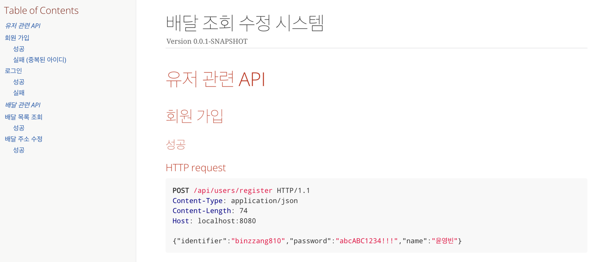

# 간단한 배달 조회/수정 시스템

## QuickStart
1. 도커 명령어를 사용하여 mysql 컨테이너를 띄웁니다.

```
docker-compose up -d
```

2. 빌드

```
./gradlew build
```

3. 실행

```
java -jar build/libs/simple-delivery-system-0.0.1-SNAPSHOT.jar
```

4. 테이블 & 초기 데이터 생성 확인

아래 예시와 같은 설정으로 되어있어야 초기 데이터 생성이 됩니다.
```yaml
spring:
  jpa:
    hibernate:
      ddl-auto: create # none
    ...
  sql:
    init:
      mode: always # always # never
```

## API 문서
application 실행 후 `[http://localhost:8080/docs/index.html](http://localhost:8080/docs/index.html)` 으로 접속하거나

`src/resources/static/docs/index.html` 소스코드에서 IDE 에서 제공해주는 크롬 아이콘으로 접속하시면 됩니다.


## 기능 사용 설명

1. 회원 가입 (`post`/api/users/register)
- 중복된 이메일로는 가입이 불가능합니다.
- 비밀번호는 영어 대문자, 영어 소문자, 숫자, 특수문자 중 3종류 이상이고 12자리 이상의 문자열로 생성해야 합니다.
- 응답으로 accessToken 을 발급받을 수 있습니다.

- payload example
```json
{
  "identifier" : "tester3@test.com",
  "password" : "Test1234!!@@",
  "name" : "테스터3"
}
```

2. 로그인 (`post`/api/users/login)
- 응답으로 accessToken 을 발급받을 수 있습니다.

- payload example
```json
{
  "identifier" : "test1@test.com",
  "password" : "Test1234!!@@"
}
```

3. 배달 조회 (`get`/api/delivery?page=0&size=5&sort=asc&startDate=2023-03-25&endDate=2023-03-26)
- Header 의 `Authorization` 에 로그인 시 받은 accessToken 을 넣어서 요청해야 합니다.
- 인증된 유저의 배달 목록을 조회합니다.
- 종료날짜(`endDate`) 은 필수 값이 아닙니다.
- 종료날짜가 존재할 경우, 시작날짜 ~ 종료날짜의 기간은 최대 3일입니다.

4. 배달 주소 수정 (`patch` /api/delivery/{id})
- Header 의 `Authorization` 에 로그인 시 받은 accessToken 을 넣어서 요청해야 합니다.
- 인증된 사용자의 배달 주소만 수정할 수 있습니다. 아닐경우 (403 Forbidden) 에러가 발생합니다.
- 현재 요청중인 배달의 주소만 수정 가능합니다.

## 개발 환경

- IDE: Intellij IDEA Ultimate
- gradle: `gradle-7.6.1`
- java: `jdk1.8`
- spring boot: `2.7.9`
- DB: mysql5.7

## 사용 라이브러리

- spring boot jpa, spring security, jsonwebtoken, lombok, spring RestDocs, junit5, Mockito